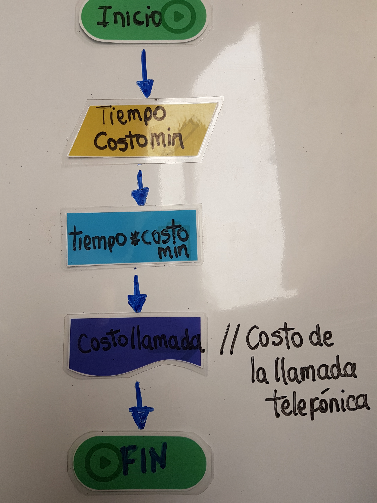

# Diagrama de Flujo
Se requiere un algoritmo para determinar el costo que tendrá realizar una llamada telefónica con base en el tiempo que dura la llamada y en el costo por minuto.

1. Inicio
2. Ingrese costmin   //costmin=costo por minuto
3. Ingrese tiempo
4. Calcular costo=costomin*tiempo
5. Resultado costo
6. Fin

